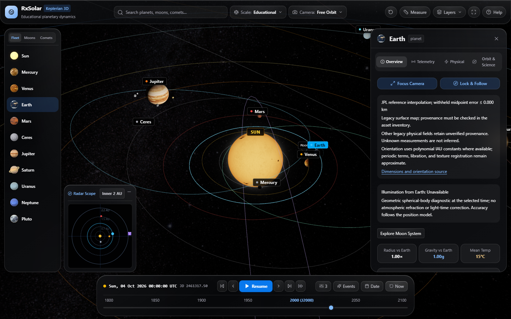

# Interactive Solar System

A browser-based 3D solar system simulator built with React, TypeScript, and Three.js. Explore celestial bodies, control simulation time, compare display scales, and inspect orbital and physical properties through an interactive space-themed interface.



## Features

- Explore the Sun, eight planets, five dwarf planets, 15 moons, and three comets.
- Calculate orbital positions using Kepler's equation, explicit catalog epochs, and fixed orbital elements.
- Play, pause, reverse, and step through simulation time, with speed presets from real time to ten simulated years per second.
- Choose a date or jump to historical event dates.
- Switch between educational, hybrid, and real display scales.
- Navigate with free, focus, follow, top, and ecliptic camera modes.
- Search for celestial bodies and inspect their physical properties and orbital telemetry.
- Measure physical distances and light-travel times between catalog bodies, including parent-relative moons.
- Toggle orbit paths, labels, moons, lighting, the habitable zone, asteroid and Kuiper belts, and a distance grid.
- View planetary textures, atmospheric glow, Earth clouds and night lights, planetary rings, and comet tails.
- Use an orbital radar to locate and focus on major planets.

## Technology

| Layer | Tools |
| --- | --- |
| Application | React 18, TypeScript |
| 3D rendering | Three.js, React Three Fiber, Drei |
| Styling | Tailwind CSS 4, PostCSS |
| Icons | Lucide React |
| Development and builds | Vite |

The application runs in the browser without a backend or database. Simulation state is held in memory and resets when the page reloads. Texture assets are included in the repository; the page also requests fonts from Google Fonts.

## Getting started

You need Node.js 24 LTS and npm, plus a modern browser with WebGL 2. Use the version in .nvmrc. Styling requires Chrome 111+, Safari 16.4+, or Firefox 128+.

```bash
git clone https://github.com/rupeshbhusare77/interactive_solar_system.git
cd interactive_solar_system
npm ci
npm run dev
```

Open the URL printed by Vite, normally `http://localhost:5173`. Access to the repository is required to clone it while it is private.

### Production build

```bash
npm run build
npm run preview
```

The build command checks TypeScript and generates the production site in `dist/`. The preview command serves that build locally. An alternative local server is available through `node serve.js` after building.

Development, preview, and the custom server are configured to use port 5173. Run one server at a time. Uploading the repository to GitHub stores the source code; hosting the live application requires a separate deployment.

## Controls

| Action | Control |
| --- | --- |
| Rotate the camera | Left-click and drag |
| Pan the camera | Right-click and drag |
| Zoom | Mouse wheel or pinch gesture |
| Select a body | Click its surface or use the search field |
| Focus on a body | Use the quick dock or a focus action |
| Change the viewpoint | Use the camera mode selector |
| Control time | Use the bottom timeline controls |
| Change display options | Use the header's view controls |
| Inspect measurements | Open the measurement panel |
| Read the in-app guide | Open Help |

The simulation initially plays at three simulated days per real second, with Earth selected and educational scale enabled.

## Display scales

| Mode | Behavior |
| --- | --- |
| Educational | Compresses orbital distances and uses calibrated body sizes for easier exploration. |
| Hybrid | Uses logarithmic distance compression with slightly smaller calibrated body sizes. |
| Real | Uses a consistent physical conversion for orbital distances and spherical body radii: 250 world units per AU. |

In real mode, planets are tiny compared with the distances between them. Use Focus to inspect individual bodies. Labels, decorative effects, the distance grid, and belt particle sizes remain illustrative.

## Project structure

```text
public/textures/          Local planetary and sky texture assets
src/
  astronomy/             Body catalog, constants, orbital calculations, and scaling
  components/
    canvas/              3D bodies, orbits, effects, belts, and camera controls
    ui/                  Header, timeline, information panel, radar, and help
  state/                 Shared simulation state and React context
  textures/              Texture loading and procedural texture generation
  App.tsx                Scene and interface composition
  main.tsx               React entry point
  index.css              Global styles and shared interface effects
serve.js                 Optional local server for the production build
```

## Verification

Run `npm run build` to check TypeScript and production bundling. Browser verification is needed for visual and interaction changes. A minimal regression suite was restored with the owner's approval for Stage 4. Run npm test for astronomy and static-server checks. Browser regressions run against a fixed UTC date, paused clock, and seeded generated assets.

## Scientific scope and known limitations

This project is an educational visualization using fixed orbital elements. It does not model gravitational interactions between bodies, orbital perturbations, or a live precision ephemeris. Historical presets select dates and bodies; they do not recreate spacecraft missions or guarantee observed alignments. The information panel exposes each orbit's epoch, reference plane, provenance, and local model limits.

Dates are entered and displayed in **UTC**. The navigation range is **January 1, 1800 through December 31, 2100**. This is a visualization policy, not a scientific accuracy guarantee. Invalid or out-of-range date submissions retain the previous time and show an error. Calendar changes require **Apply UTC Date**. Playback pauses at either boundary; stepping is clamped to the same limits.

The calculation uses uniform 86,400-second days and treats the UTC timestamp as approximate dynamical time. J2000 is numerically represented by `2000-01-01T12:00:00Z`; the actual astronomical epoch is noon TT. Leap seconds, TT/TDB offsets, and relativistic time corrections are omitted. [JPL's time-scale documentation](https://ssd.jpl.nasa.gov/horizons/manual.html) describes the distinctions required for precision ephemerides.

Orbital arguments are measured from the ascending node, periods are positive, and inclinations encode orbital direction. Physical coordinates use AU in a right-handed world frame `(ecliptic X, ecliptic Z, −ecliptic Y)`. Parent-equator satellite orbits use the parent's static illustrative pole transform; Earth's Moon retains its ecliptic reference. Legacy phases and pole azimuths with no recovered provenance are explicitly marked illustrative. Signed physical rotation periods identify retrograde bodies; rendered rotation uses a directed pole without reversing the direction twice.

Comet propagation is local to the sourced perihelion model. Halley's 1986 and Hale-Bopp's 1997 passages were checked during Stage 1; future returns, including Halley in 2061, remain approximate. Static pole directions and arbitrary texture prime meridians do not reproduce precise surface orientation, seasons, lunar phases, eclipses, or the day/night terminator. Do not use this model for observation or mission planning; use [JPL Horizons](https://ssd.jpl.nasa.gov/horizons/) for precision states.

The fixed Earth orbit was compared against an independent implementation of [JPL's Table 1 model](https://ssd.jpl.nasa.gov/planets/approx_pos.html), which includes element rates. The reference is the Earth–Moon barycenter, rather than Earth's center. These samples measure differences between two approximate models; they are not a guaranteed error bound against observations or Horizons.

| UTC sample | Position difference |
| --- | --- |
| January 1, 1900, 12:00 | Approximately 130,873 km |
| January 1, 2000, 12:00 | Approximately 2,310 km |
| October 3, 2026, 00:00 | Approximately 21,081 km |
| January 1, 2050, 12:00 | Approximately 61,968 km |

These comparisons were recorded during Stage 1 verification. The test fixtures and reference generator were subsequently removed at the project owner's request.

- Moon rendering, camera tracking, measurements, and information-panel distances use shared parent-relative positions. Their numerical consistency does not establish observed phase accuracy for illustrative satellite records.
- Educational and hybrid scales deliberately change visual proportions and spacing. Numerical measurements use physical coordinates before display scaling.
- The measurement line mounts only while the measurement panel is open.
- Missing texture maps recover in place with procedural or neutral replacements. Loading and fallback status are visible; failed graphics contexts offer a scene retry.
- Stars, procedural textures, and belt particles use random generation, so their appearance can vary between sessions.

## Repository contents

Keep application source, `public/` assets, configuration files, `package.json`, and `package-lock.json` in version control. The `.gitignore` excludes installed dependencies, generated builds, coverage, environment files, logs, personal editor settings, and the local project context file. Sanitized `.env.example` files can be tracked if environment configuration is introduced later.

## First exploration

Pause the timeline, search for Earth, and select Focus Camera. Switch between educational and real scale to compare visible proportions. Open Measure and choose Earth ⇄ Moon to inspect physical distance independently of display scale. Top View and Ecliptic expose an inner/outer/full region selector. On phones, camera and scale settings are in the settings drawer.

## Release validation

```bash
npm ci
npm run check
npm audit --audit-level=high
npx playwright install chromium
npm run build -- --base=/interactive_solar_system/
npm run test:browser
```

The screenshot above was captured from the production build at 1280 × 720, paused at October 3, 2026 UTC with seeded generated assets.

The browser suite serves the production build under /interactive_solar_system/ and covers desktop/mobile keyboard search, lunar measurement, guide dismissal, camera regions, and failed-map recovery. CI runs the same checks and uploads dist as a reviewable artifact. Remote CI results require the owner's later push. If the browser download is unavailable, installed Edge can be used locally by setting PLAYWRIGHT_CHANNEL=msedge; CI uses Chromium.

For a root-hosted site, use npm run build without --base. For another subfolder, pass its leading/trailing-slash path through --base. Texture URLs follow Vite's build base. The optional server accepts PORT and BASE_PATH environment variables and binds only to 127.0.0.1. It rejects traversal, sends real asset 404s, revalidates unhashed files, and caches hashed build assets immutably. It is a local preview, not a production hosting service.

Hosting remains undecided. GitHub Pages is one option, but private repositories require a qualifying paid plan, and ordinary Pages sites can be publicly accessible even when source is private. No Pages settings or deployment were enabled. See [GitHub's Pages requirements](https://docs.github.com/en/pages/getting-started-with-github-pages/creating-a-github-pages-site) before choosing that target.

## Attribution and contribution

[Asset provenance](docs/ASSET_SOURCES.md) lists the local texture files and their verified status. Original image authors, redistribution terms, and download URLs have not been recovered. Existing NASA wording in historical comments is not proof of provenance. Resolve those entries before a public release. No project license has been selected; do not assume permission to redistribute assets.

For contributions, use Node.js 24, install with npm ci, keep changes focused, and run the release checks above. Include a paused UTC date and viewport dimensions when reporting visual defects. Preserve physical calculations separately from illustrative display scaling.

Before release: confirm image redistribution rights, select a project license, choose hosting, review the build artifact, and run CI after the owner commits and pushes. Publish only after those owner decisions. No live-demo URL is claimed.

## Sourced celestial systems

The simulator includes 460 JPL mean-orbit satellite records across Earth, Mars, Jupiter, Saturn, Uranus, Neptune, and Pluto. The independently imported discovery catalog lists 293 Saturn moons; 291 have records in the imported orbital table. Missing positions are not invented. Small moons appear as selectable navigation markers, whose point size does not represent a measured radius. Use the planet inspector's moon filter and **Explore Moon System** action to inspect an inner satellite system.

Sixteen additional NASA-hosted mission-image mosaics replace procedural appearances for selected moons. NAIF planetary constants provide measured triaxial dimensions and polynomial pole/rotation models where available. Map coverage, color processing, longitude registration, satellite periodic orientation terms, and Hyperion's tumbling remain approximate or unknown. Existing legacy maps retain their separate provenance limitations.

### Reference positions and accuracy

Bundled JPL Horizons geometric vectors cover October 1–9, 2026 for 44 bodies. Files load from the site's own static assets; browsers never call JPL APIs. Cubic Hermite interpolation uses positions and velocities in J2000 ecliptic coordinates with UT timestamps. Independent withheld midpoint samples have measured errors below 5 km; this is an interpolation validation result, not a bound on observational uncertainty or every possible timestamp. Coverage ends at each body's actual last sample, which may precede October 9 slightly. Outside coverage, or if a file cannot load, the inspector explicitly identifies approximate fixed-element propagation. Daphnis has no available Horizons coverage for this interval.

The inspector reports geometric illumination, parent eclipses at the moon's center, moon transits across the parent disk from Earth, and pair barycenter offsets. Calculations use physical coordinates and spherical radii, independent of display scaling. They do not predict event contact times or include refraction, light-time correction, or terrain. Reference planetary positions already contain the modeled barycentric motion; no second correction is added.

Saturn's rendered D–F rings use circular boundary and gap dimensions from the [NASA PDS Ring-Moon Systems Node](https://pds-rings.seti.org/saturn/saturn_tables.html). Representative optical depths, neutral color, and scattering remain approximations. Faint outer rings and time-variable fine structure are omitted.

### Refreshing the scientific assets

These maintenance scripts use sequential requests and require network access:

- `node scripts/refresh-science.mjs`: refresh JPL catalog and NAIF constants.
- `node --experimental-strip-types scripts/refresh-ephemerides.mjs`: regenerate bounded reference vectors and withheld checkpoints.
- `node scripts/refresh-surfaces.mjs`: refresh NASA-hosted moon maps and source hashes.

Review generated data and run `npm run check`, `npm run build`, and `npm run test:browser` after refreshing. Catalogs can disagree in coverage and confirmation status; the UI reports discovery and orbital coverage separately. The current reference files total 0.89 MiB and load on demand.
